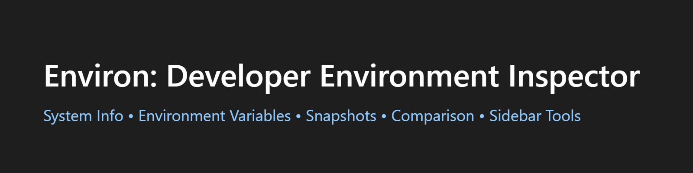
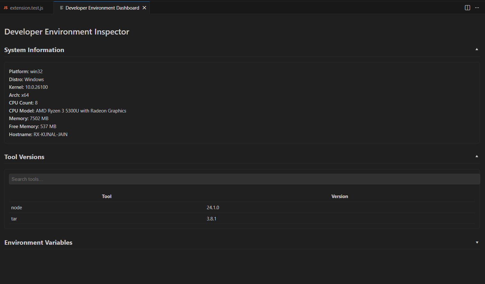
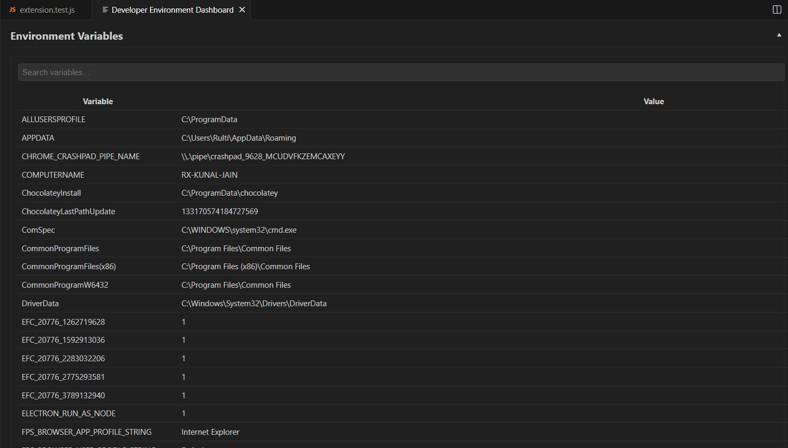

# 🌿 **Environ – Developer Environment Inspector**

Environ is a developer-focused VS Code extension that gives you **deep visibility** into your local system environment.

It helps you:

* ✔ Inspect **system information**
* ✔ View **installed tool versions**
* ✔ Explore **environment variables**
* ✔ Create **environment snapshots**
* ✔ Compare snapshots to detect configuration drift
* ✔ View a **sidebar tree view** with live details

Perfect for debugging environment issues, onboarding new machines, validating dev setups, or sharing reproducible configurations across teams.

---
## 📸 Screenshots :

<div style="display: flex; overflow-x: auto; gap: 16px; padding: 10px 0;">
  
  
  
  
</div>


---

# ✨ **Features**

### 🔧 **1. System Information Panel**

Displays key OS-level details:

* Platform & distro
* Kernel version
* Architecture
* CPU model & count
* Total & free memory
* Hostname

### 📦 **2. Tool Version Detection**

Scans for commonly installed tools on Windows/macOS/Linux:

* Node, npm, Python, pip
* Java, Go, Rust, .NET
* Git, Docker, kubectl
* And many more

All presented in a clean searchable table.

### 🌍 **3. Environment Variables Viewer**

List all environment variables in a searchable grid.

Useful for debugging PATH issues, API keys, and environment mismatches.

### 🧩 **4. Snapshot Creation**

Create an environment snapshot containing:

* System info
* Installed tool versions
* Environment variables

Saved as a structured JSON file.

### 🔍 **5. Snapshot Comparison (Diff Viewer)**

Compare two snapshots to find:

* Added environment variables
* Removed variables
* Changed values
* Version differences
* System info drift

Differences are color-coded for fast visual parsing.

### 📁 **6. Sidebar TreeView**

A permanent panel inside the Explorer sidebar:

* System Info
* Versions
* Environment Variables
* Snapshots

Auto-refreshable and easy to browse.

---

# ⚙️ **Requirements**

No prerequisites required.
Works on:

* Windows
* macOS
* Linux

The extension does **not** require admin access or elevated permissions.

---

# 🔧 **Extension Settings**

This extension contributes the following settings:

### `devEnv.snapshotPath`

(Optional) Override the default folder where snapshots are stored.

Example:

```json
"devEnv.snapshotPath": "D:/env-snapshots"
```

If not set → snapshots are stored in VS Code’s global extension storage.

---

# 🐞 **Known Issues**

* Some tools may not respond consistently to `--version` on older systems.
* Very large `PATH` variables may cause slow rendering (planned optimization).
* Snapshot comparison currently shows flat diffs (hierarchy coming soon).

Report issues at:

👉 [https://github.com/](https://github.com/)<your-username>/<your-repo>/issues

(I can generate the whole GitHub repo boilerplate if you want.)

---

# 📝 **Release Notes**

## **1.0.0**

* Initial release
* System Info viewer
* Versions scanner
* Environment viewer
* Snapshot creator
* Snapshot diff viewer
* Sidebar explorer

## **1.1.0** *(suggested future updates)*

* Added copy-to-clipboard buttons
* Added list of installed compilers/interpreters
* Multi-snapshot diff

---

# 📘 **Following Extension Guidelines**

* [https://code.visualstudio.com/api/references/extension-guidelines](https://code.visualstudio.com/api/references/extension-guidelines)

---

# Enjoy!

**Environ** is designed to make your dev environment transparent, reproducible, and easy to debug.
If you'd like to add more features—React UI, themes, cloud sync, GitHub Gist snapshot sharing—just ask!

---